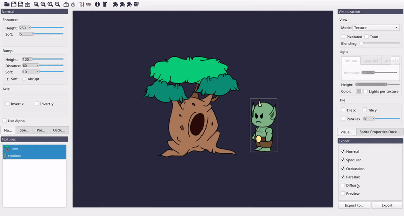

First steps with Laigter
========================

When opening Laigter, you will see a default image, with default settings.
All maps were generated for this sprite and you can see each of them and the
result with lighting changing the preview mode in the view dock widget.

Importing Sprites
-----------------

But probably, the first thing you want to do with Laigter, is test with your
own sprites, so lets see how to do it.

.. warning::
   Since switching processing library image for achieving simpler and more
   maintainable code, map generation became a bit slower. So you may need to
   wait a bit after importing a texture, as all maps will be generated at that
   moment.

If you don't have any sprite to test at the moment, you can use try with this two:

You can import those images into Laigter by simply draging them to the main window,
or using the |import| (import) button in the toolbar.

Selecting Sprites
-----------------

If you drag both images at the same time into Laigter, you should see both of them
rendered on the preview central widget. Both of them will be selected and positioned
in the "World's" origin (this is, the center of the preview widget when Laigter is
opened). Clicking on one of them, will only select that sprite. You then can freely
move that sprite arround. Holding Ctrl while clicking multiple sprites will allow
you to select multiple sprites and moving them all at the same time.

Textures Dock Widget
^^^^^^^^^^^^^^^^^^^^

Sometimes you don't want to render all opened sprites, or you want to change the
order they are being rendered, so you can put a sprite "in front of" another one.
This is done trhough the "Textures" dock widget.

In this widget, you can see a list of the opened images. Selecting one of them, will
only make that image visible in the canvas. You can select multiple images from the
list holding Ctrl and clicking on them, and all selected images will become visible.
You can drag items on that list to change the order of rendering. The images on the
top of the list will be rendered first, and thus, appear behind the images on a lower
position.

You can right-click on an item of the list to open a context menu with different
actions. You can remove an image selecting the "Remove" action from the context
menu. The rest of the actions will be covered in other sections.

Moving and Rotating the canvas
------------------------------

Sometimes its useful to move the canvas arround, for example, to get a better view of
a texture region that is very zoomed in. Sometimes it is needed to rotate the canvas,
for example, for making painting with brushes easier.

In Laighter you can move the
canvas, which adds an offset to the world's origin, pressing and dragging right clic
on a free space (i.e, without selecting any texture).

You can rotate the full canvas pressing and dragging left click, while holding Shift key.

.. image:: img/canvastransform.gif

Sprite Properties Dock Widget
-----------------------------

This dock widget has some controls to modify the appearance of the currently selected
sprite.

Transformations
^^^^^^^^^^^^^^^

You can apply some simple transformations to the sprite, in order to make it easier
for you to work on them. This transformations don't affect the map generation, but
only change position, rotation, or scale of the sprite.

Sprite position
"""""""""""""""

You can move any sprite by simply clicking on it and draging it arround the central
canvas.

If you want to set the position in a more precise way, you can also head to the
"Sprite properties Dock Widget" and set the desired position in the spin boxes.
Have in mind, this positions are relative to the "World", whith origin in the center
of the widget when you open Laigter.

.. note::
   The sprite should be selected for the transformation to have effect. In the Sprite
   Properties Dock Widget you can see the currently selected sprite.

Sprite rotation
"""""""""""""""

You can also rotate the sprite. This is useful for handpainting when using brush plugins (which will be covered on their own sections), or just for previsualization purposes. The only way for rotating a singe sprite right now is to set the desired angle in the corresponding spinbox on the "Sprite Properties Dock Widget".

Sprite scale
""""""""""""

The "Sprite Properties Dock Widget" also includes a spinbox to modify the scale of
the sprite. This feature was added for the sole reason of visualization, as some
times you may want to make a texture bigger than other for mockup purposes.

For scaling a sprite, you just need to select it and modify the value at the
corresponding spinbox.

.. warning::
   Some brush operations may work in an unpredictable way with scaled sprites. This
   feature is currently only for visualization purposes. If you need to use a brush
   on a closer look to the sprite, use zoom instead.

Properties that affect the map generation
^^^^^^^^^^^^^^^^^^^^^^^^^^^^^^^^^^^^^^^^^

Some properties affect the map generation, and will be covered in their corresponding
sections for a better understanding of them. Those are:

- Animation controls (Split button)
- Tile options (Tile checkbox and Neighbours button)

You can see those controls on the "Sprite Properties Dock Widget" image at the
beginning of this section.

Image information
^^^^^^^^^^^^^^^^^

Information is hidden by default, so it doesnt waste space on low resolution screens.
Checking the "Information" checkbox, a list of data will be shown. This includes:

- The image name.
- The image path on your file system.
- The image size in pixels.

You can see this information on the "Sprite Properties Dock Widget" image at the
beginning of this section.

If you would like to have more information there, please request it!

Visualization Mode
------------------

You can change the visualization mode in the "Visualization" dock widget, changing
the selection in the "Mode" combo box. This will let you see the corresponding
generated map for the visible sprites, as well as a real time lighting preview.

Most of the features indluded in this widget will be covered in the corresponding
section, but it was necessary to show the visualization mode here so you can go
ahead and generate your firsts maps with Laigter!

.. |import| image:: ../Introduction/img/import.png
            :scale: 50 %
