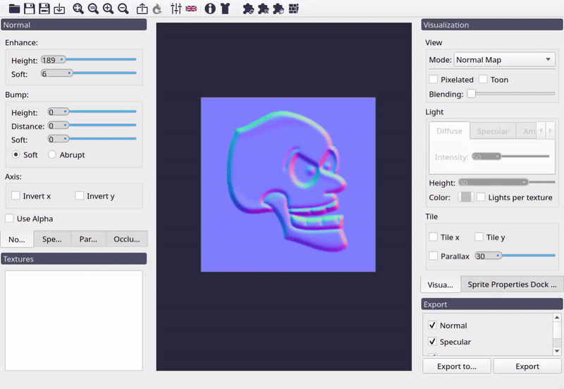
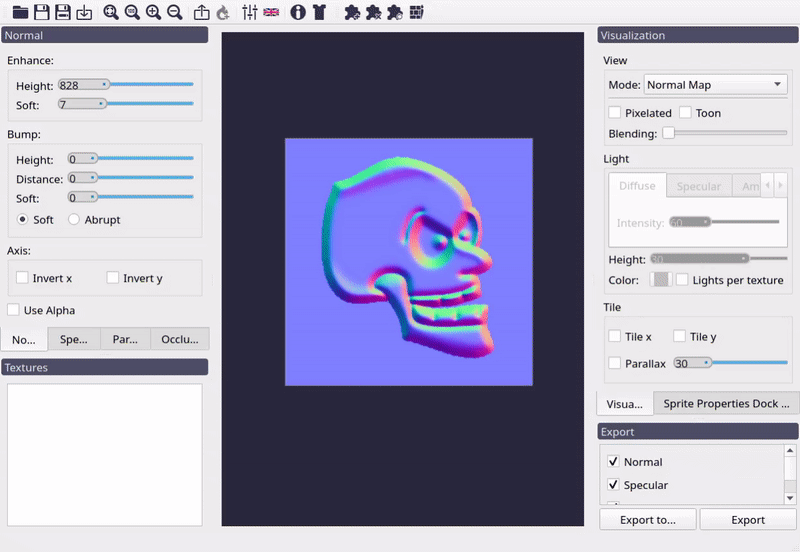
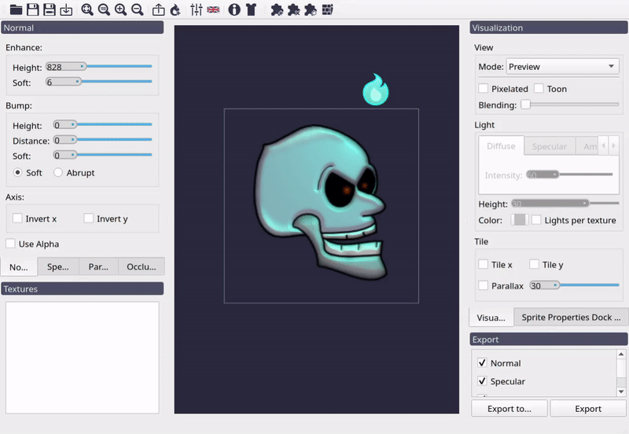
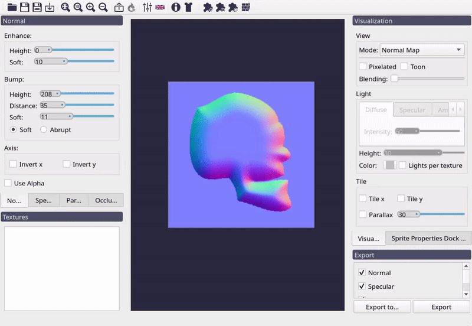
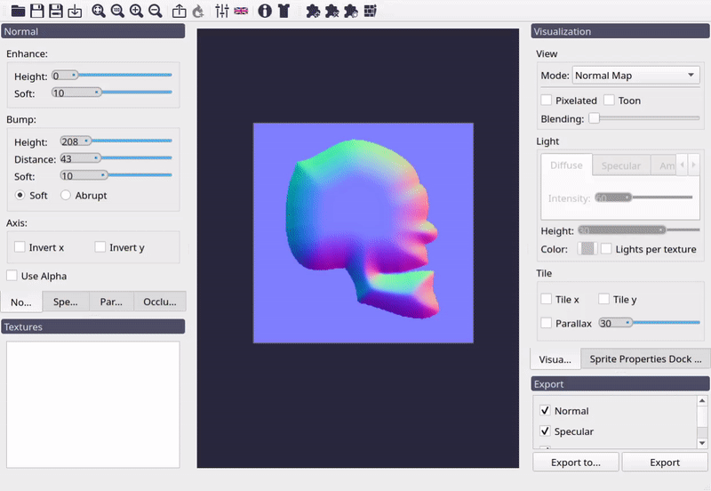
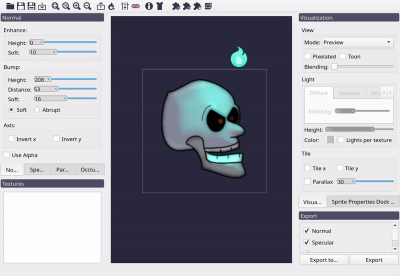
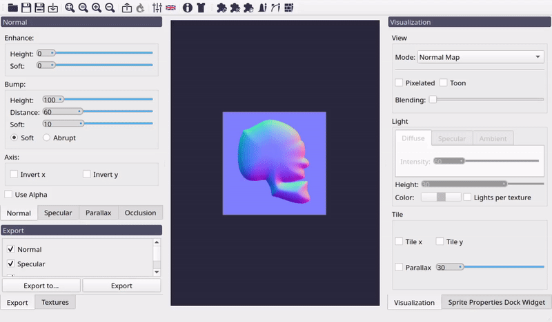
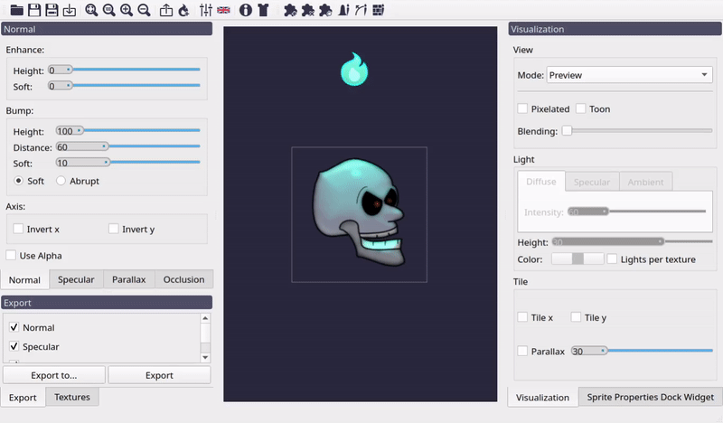
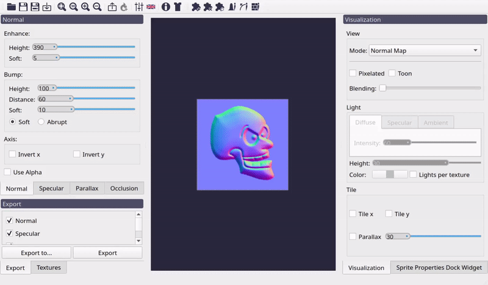

Normal Map Generation
=====================

Laigter aims to be a simple normal map generator. To tweak the normal map you only
to play around with the sliders until you get the desired result. In this section
what each of those sliders do will be explained.

Al the controls that affect the normal map generation are grouped under the **Normal**
dock widget. 

.. _enhance_controls:
Enhance controls
----------------

The controls under this group affect the detail, or *inner regions* of the sprite.
For a better understanding of what they do, lets put the controls under *Bump* group
to zero.

There are just two controls under the *Enhance* group, *Height* and *Soft*.

Height Control
""""""""""""""

A normal vector can be thought of as the derivative of the height on a surface. If
that height almost doesn't change (like on a flat surface) the normal will point
upwards (or to the screen, in our case of 2D textures). This will lead to the blueish
color we talked about in the `normal map example <https://laigter.readthedocs.io/en/latest/Introduction/intro.html#normal-map-example>`_ of the introduction section.
So this control lets you chose how high is the difference in height between
consecutive pixels. A lower value then, will result in a more flat normal map
(more blueish).
A higher value would mean normal vector directions point to other directions,
and so, more *colorful* normal map (as colors represent components of the vector).
The effect of the light will be more noticeable in this last case.

   Effect of *Enhance* height control in the normal map.

   Effect of the *Enhance* height control in the preview.

Soft Control
""""""""""""

After the normal map due to the "Enhance controls" was generated, a blur is applied
to get a better-looking result. The amount of blur applied is controlled with this
slider.

   Effect of *Enhance* soft control in the normal map.

   Effect of the *Enhance* soft control in the preview.

Bump controls
-------------

Enhance controls are meant for generating normals of inner details of the texture.
But for 2D sprite, is useful to give some bump effect from its edges. This means,
make the sprite look like it has volume. This is made by making a distance transform
with the alpha mask of the texture, and using it as a heightmap for calculating the
normal vectors.

For this, we use the controls under the *Bump* group, which has four different
controls. for a better understanding of this controls, lets put the *Enhance*
controls in zero.

Height Control
""""""""""""""

This control makes the same effect as the one with the same name described in
:ref:`enhance_controls`, but this time to the normals generated from the edge of
the texture.

   Effect of *Bump* height control in the normal map.

   Effect of the *Bump* height control in the preview.

Distance Control
""""""""""""""""

The previous control helped us to tweak the normal vector direction from the edges
of the texture. This control specifies the distance from the edge of the texture to
the center of it before the *Bump* normal map flattens.

   Effect of *Bump* distance control in the normal map.

   Effect of the *Bump* distance
            control in the preview.

Soft Control
""""""""""""

This control also makes the same effect that it's homonymous in the *Enhance* group.

   Effect of *Bump* soft control in the normal map.

   Effect of the *Bump* soft control in the preview.

Soft/Abrupt radio buttons
"""""""""""""""""""""""""

These radio buttons are used to specify how the distance should be calculated from the
edges of the sprite to the center of it. Selecting *Soft* will make the height generated
by *Bump* controls increase in a way that tries to emulate a spheric bump. *Abrupt*
option instead, will make the height increase linearly.

   Effect of *Bump* soft/abrupt radio control in the normal map.

   Effect of the *Bump* soft/abrupt radio control in the preview.

Axis Controls
-------------

This group contains only two checkboxes, used to invert de *x* or *y*
component of the normal vector respectively. This is used in case you
want the final effect looks like a *bump* or a *sink*.

.. note::
   Some engines or tools (like Godot) use down direction as positive y.
   For normal maps to work correctly on them, you need to check *Invert y*
   control. Right now is the only way to achieve it, although shortly there will be an on-export option for this.

   Effect of inverting axis in the normal map.

.. figure:: img/axis-invert-preview.gif

   Effect of inverting axis in the preview.
