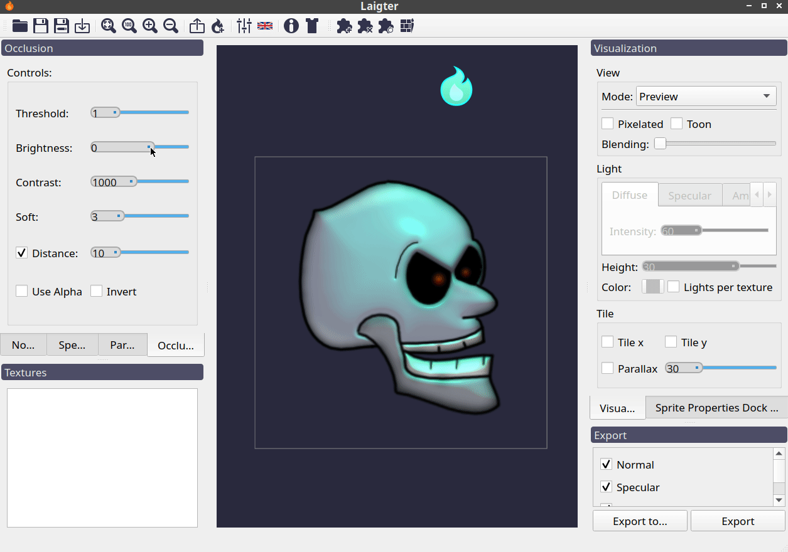
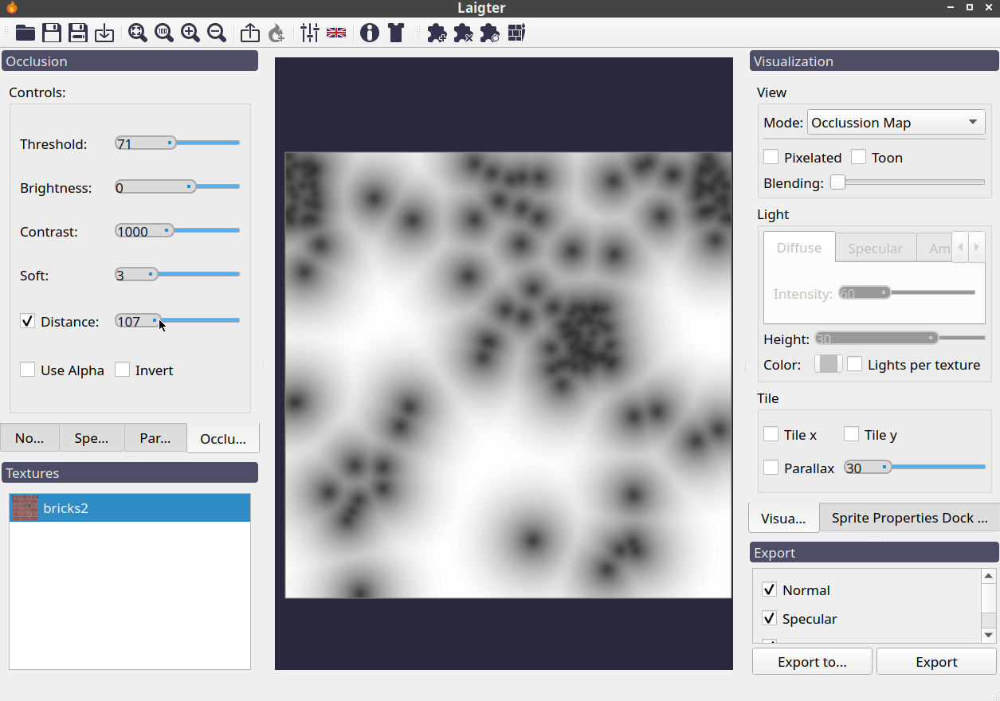

Occlusion Map Generation
========================

An occlusion map is a 2D grayscale texture. It just specifies how much amount of
ambient light should affect each pixel. Darker pixels on the occlusion map means less
light should affect the corresponding pixel in the original texture, and white pixels
mean that the corresponding pixels in the original texture should be affected by the light normally.

   Example of the effect of an *occlusion map*.

Controls
--------

Threshold, Brightness, Contrast, Soft and Invert controls have the exact same
effects on the occlusion map as those explained in :doc: `specular-map-generation`
for a specular map, so we won't go in detail here. There is only one control that is
worth explaining in this section.

Distance Control
""""""""""""""""

This control consists of a checkbox and a slider. If enabled, instead of a regular
grayscale version of the original texture, you will end up having a distance map. It
will be assumed that pixel values below the threshold value should be darker, and
the distance control lets you adjust how much that darkness should spread to pixels
nearby. If disabled, all the other controls work just like in :doc: `specular-map-generation`.

