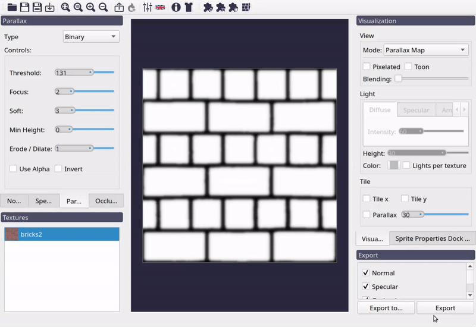
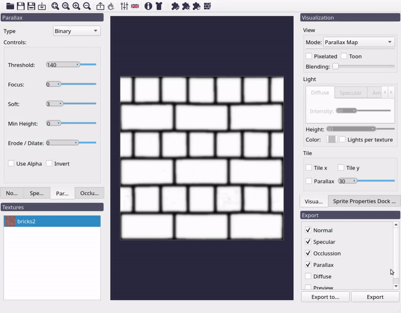
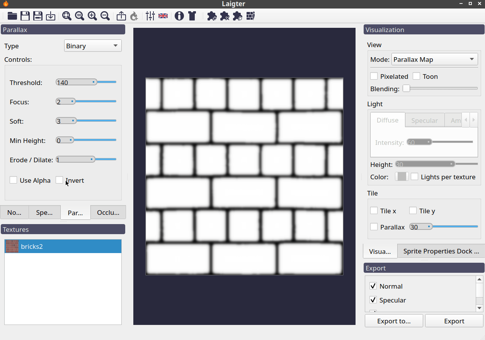
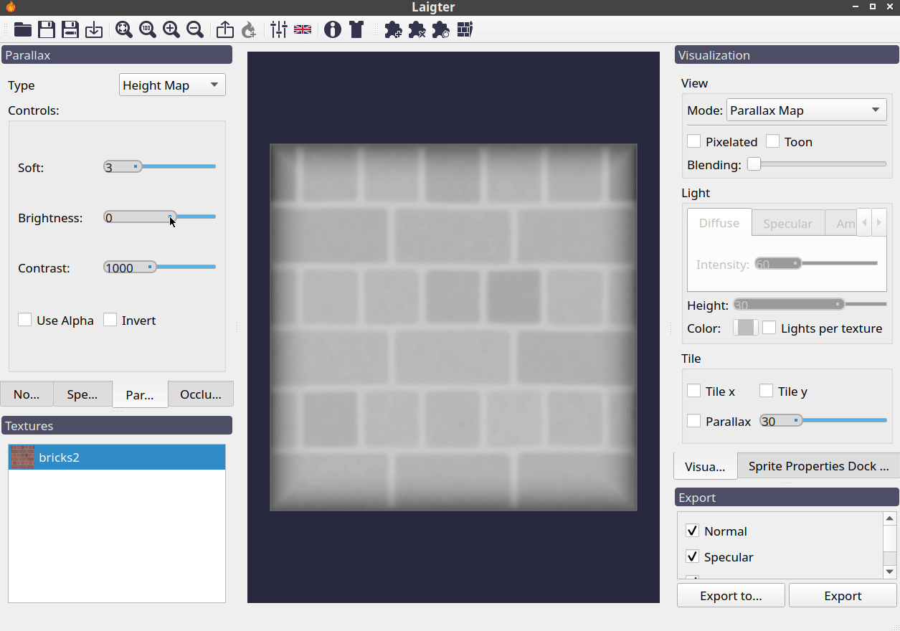
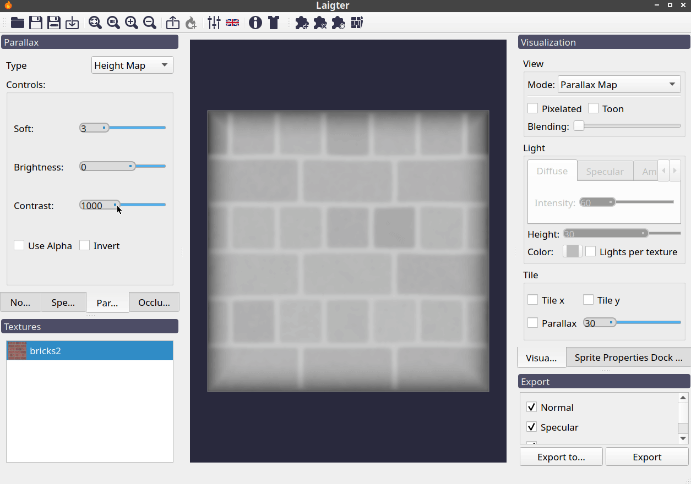

Parallax Map Generation
=======================

This one is probably the less used map in 2D games, but you can generate and preview
it with Laigter anyways! Parallax mapping is similar to displacement techniques, in
the sense that both techniques use grayscale textures to give information about
height/depth/displacement. In displacement techniques, however, we use that
information to move the vertices of the 3D object to achieve better surface detail.
This makes it necessary for the object to have many vertices to look nice.
Parallax mapping, instead, makes the calculation on fragments, just picking the color
the user would see if the object had that displacement. This way, we can just apply
the displacement with as little as four vertices (one quad or two triangles).

This is an example of how a 2D texture looks with parallax mapping technique.

.. figure:: img/example-parallax.gif

   Parallax effect example.

Parallax generation in Laigter has two modes, *Binary* and *Heightmap*. The first
makes a black and white version of the current texture and lets you adjust some
parameters to tweak the parallax map. The resulting parallax map is still a
grayscale image, as the controls will affect the resulting color. The latter will
take the generated heightmap for normal map calculation, and use it directly as a
parallax map, again, allowing users to tweak it through controls.

.. note::
   In Laigter, the parallax map is analog to a depth map. Lighter colors mean that fragment should be at a deeper z position, and darker colors mean that the fragment should remain closer to the original position. Of course, the z position is just an effect, as no 3D processing is done here.

Binary Mode
-----------

Binary mode is useful for simple patrons, like brick walls. It will binarize an image
given a threshold, and generate the parallax map from that image.

.. note::
   For those who doesn't know, binarizing an image means taking the value of a pixel,
   and making it white if it's above a threshold, or black if it's below.

Threshold Control
"""""""""""""""""

This control allows the user to chose the threshold for the binarization.

   Effect of *Threshold* control on parallax map.

Focus Control
"""""""""""""

This control applies a blur previous to the binarization. That way, is the
image is too noisy, you can get rid of small "islands" when making the binary image.

   Effect of *Focus* control on parallax map.

Soft Control
""""""""""""

As in all maps, this control just applies a blur to the resulting map.

   Effect of *Soft* control on parallax map.

Min Height
""""""""""

This slider lets you adjust the minimum height of the map. As in this mode, the image
is binarized, this means all pixels will turn black (0) or white (255) depending on the threshold, and after that, other effects will be applied. With this control, you can
adjust the minimum to be higher than 0.

   Effect of *Min Height* control on parallax map.

Erode/Dilate
""""""""""""

The binarized image will generally result in black islands on a white background or
the other way round. With this, you can make those islands smaller (erode) or bigger
(dilate). Positive value will dilate the white regions, and negative will erode them.

   Effect of *Erode/Dilate* control on parallax map.

Invert
""""""

This checkbox just lets you invert the parallax map.

   Effect of *Invert* control on parallax map.

Height Map Mode
--------------

Instead of binarizing the texture, this mode uses the generated or loaded heightmap
used for normal map generation, as the parallax map. Of course, it also provides a
set of controls to tweak this, without affecting the normal map.

Soft Control
""""""""""""

Same as *soft* slider explained in binary mode. It just applies a blur to the result.

Brightness Control
""""""""""""""""""

With this control, you can add a constant value (positive or negative) to the map, to
make it lighter or darker.

   Effect of *Brightness* control on parallax map.

Contrast Control
""""""""""""""""

This slider is used to augment or reduce the contrast of the resulting map.

   Effect of *Contrast* control on parallax map.

Invert Control
""""""""""""""

Same effect as *invert* control explained in binary mode.
