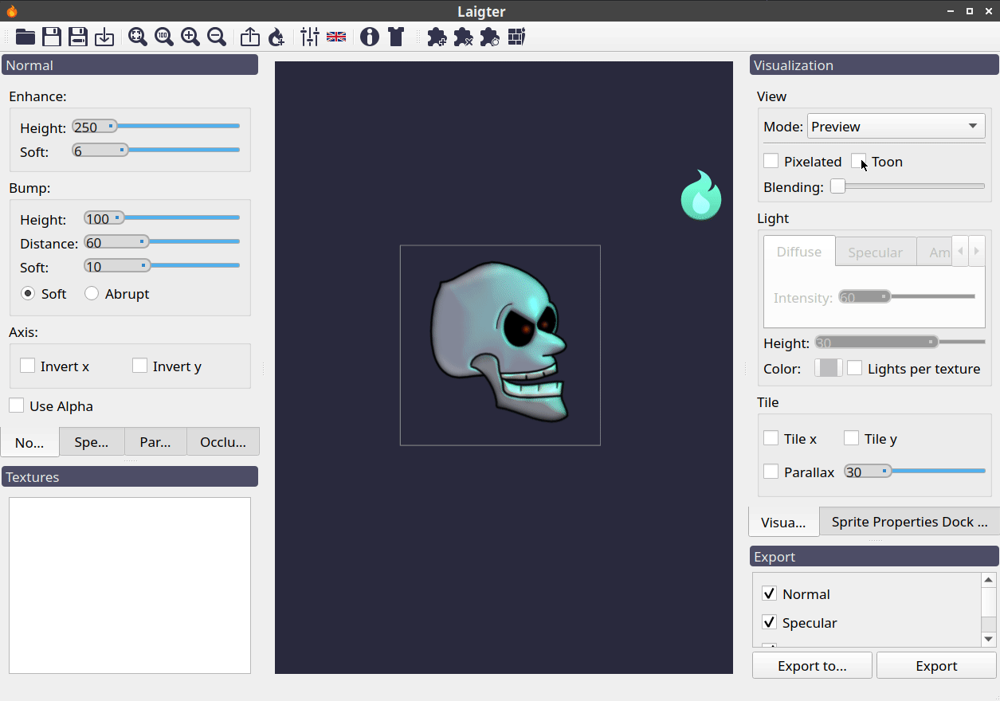
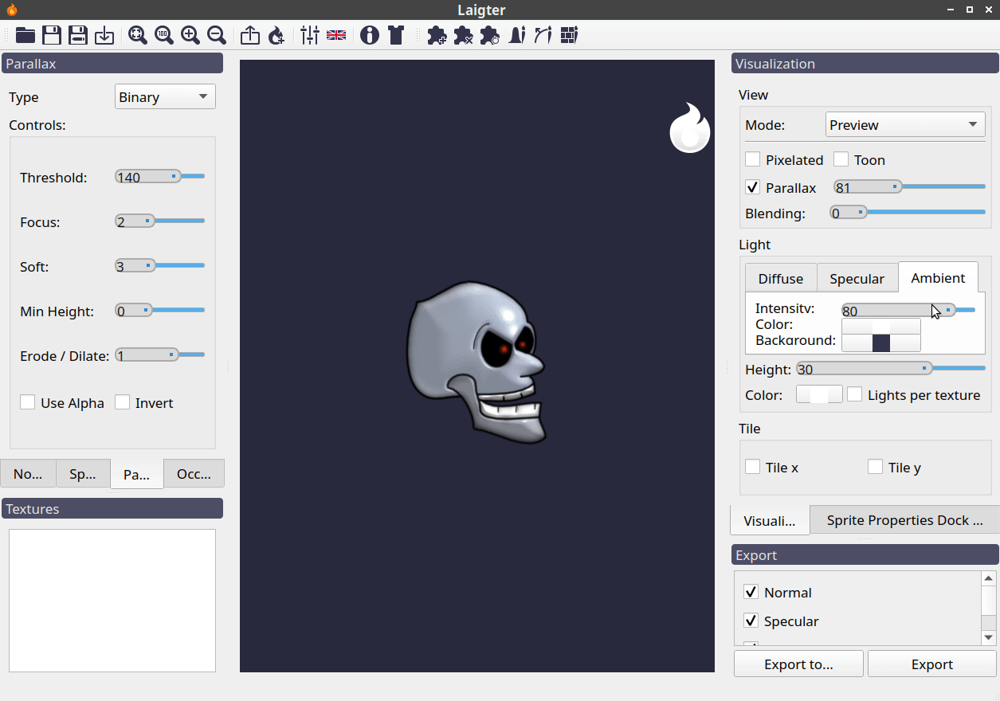

Real-time lighting preview
==========================

Besides generating the maps for dynamic illumination, Laigter also has a real-time
preview mode, in which you can add light sources, configure them, and move them
arround, to see how the lighting effect would look in-game.

.. note::
   All settings in the *Preview Dock* are only for preview purposes. They will not
   affect the generated maps, and if there is any effect you want to reproduce in
   your game, you will have to code the shader yourself if it is not supported out
   of the box in your game engine.

Preview Settings
----------------

Similar to the docks that contains the controls for the maps generation, the preview
dock has settings to tweak what is rendered. This settings are divided in *View*,
*Light*, and *Tile* groups.

.. warning::
   Different versions of the tool may have some controls in a different group
   compared to what is written here.

View
""""

This group contains the basic preview settings.

Mode
''''

This drop-down menu lets you choose the current view mode. There is an option for
previewing each map, with its respective name, and an option for real-time lighting
preview.

   Changing view mode in the *Preview Dock* settings.

Pixelated Option
''''''''''''''''

Checking this option will make all textures to be rendered without filter, so you
can see the pixels of the original texture, and resulting maps. This option is
useful when generating maps for pixel-art sprites.

   Testing *Pixelated* option in real-time preview.

Toon Option
'''''''''''

This options lets you set lighting in a simple toon mode. It uses the simplest toon
shader, so dont expect anything fancy. When you are making a game with such effect,
it is useful to be able to preview at least something similar to the final effect
before exporting.

.. note::
   This otpion only affects real-time preview, as it needs light to work.

   Testing *Toon* option.

Blending Control
''''''''''''''''

When using brushes, for painting a normal map for example, it is useful to be able to
see the original texture for reference. This slider allows you to blend the original
sprite with the currently selected map in the preview mode drop-down menu.

.. note::
   This option only works while previewing a genearted map (normal, parallax,
   specular or occlusion), as blending the original texture in texture or preview
   mode won't have any effect.

   Blending original sprite with normal map.

Parallax Controls
'''''''''''''''''

For previewing parallax effect, you need to check the check-button. The slider allows
you to choose the depth of the parallax map. This is disabled by default, as it
uses a considerable amount of resources.

   Example of parallax effect preview.

Light
"""""

This group of controls are used to tweak properties of illumination.

.. note::
   You have to select a light for this group of controls to be neabled.

This group is divided in three tabs: *Diffuse*, *Specular*, and *Ambient*. All light
sources in Laigter have a diffuse and a specular component. Also, there is an ambient
light present, independent of light sources. The settings of each type of light are
under the corresponding tab in the *Light* group.

Also, after this tabs, there are controls for setting height and color of the ligth
source. This are not located in the tabs, because color and height affect specular
and diffuse light components the same way.

Last option is to be able to have individual light sources per texture loaded.

Diffuse Light Controls
''''''''''''''''''''''

The diffuse component of the light sources has only one setting, the *Intensity* of
the light. The higher this value is set, the brighter the light source becomes.

   Effect of changing intensity of diffuse light.

Specular Light Controls
'''''''''''''''''''''''

The specular component of the light source has two controls. *Intensity* specifies,
as in diffuse component, the energy of the specular component (the higher, the brighter), and *Scatter* makes the specular component be less focused on one point, and
scatter in the surface.

   Effect of changing settings of specular component of the light source.

Ambient Light Controls
''''''''''''''''''''''

In this group of settings, you can change the intensity and color of the ambient
light, and the color of the background of the preview. Think of amient light as an
uniform light that is present in all the scene.

   Effect of ambient light settings.

         
Light Color
'''''''''''

This button just opens a color-picker, so you can choose a new color for the selected
light source.

   Changing color of selected light source.

Light Height
''''''''''''

This settings affect where in the z-axis should the light be placed. If we imagine
the canvas as a plane where all the textures are rendered, the height of the light
is how far is the light from this plane.

   Changing the height of a light source.

Lights per texture
''''''''''''''''''

Usually, having light sources that affect all sprites is enough. But sometimes, for
mockup purposes, it is useful that each texture retains its own lights sources and
settings.

If you have this option checked, selecting a texture will also recover the light
settings that were configured the last time that texture was selected. This allows
you a flexible way to have different lights on each sprite.

   Changing textures with *Lights per texture* option enabled.

Selecting multiple textures with this option enabled will make all of the light
sources for each texture to appear in the screen, and affect all sprites.

   Selecting multiple sprites whit *Lights per texture* enabled.

.. warning::
   When unselecting *lights per texture* option, Laigter will use default lights.
   This lights are those created and modified when the option was unselected. So
   changes you make to lights with *lights per view* enabled will not be present
   in the default lights when disabling that option.

Adding and removing lights
--------------------------

Laigter also lets you add multiple lights to the same scene. This is done with the
*Add Light* toolbar button.

The *Add Light* button is a toggle button. When pressed, you enter in *add-light*
mode. Left-click on the canvas will add a light in the position of the click, and
right-click on a light, will remove it from the scene. You can exit the *add-light*
mode by unpressing the *Add Light* button, or by right-clicking in the canvas (i.e
right-click anywhere in the canvas where there isn't a light source placed).

   Adding light sources.

Every new light will use the same settings of the last light selected. You can change
the settings afterwards by selecting the light you want to tweak, and modifying the
controls explained above in this document.

.. note::
   *Add Light* button will only be enabled if you are in preview mode, as you cannot
   see lights in other modes.

.. warning::
   Adding a light with *lights per texture* will only add that light to the currently
   selected sprite, and thus, it will not be visible when selecting other sprite.
