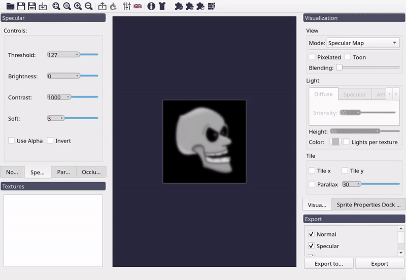
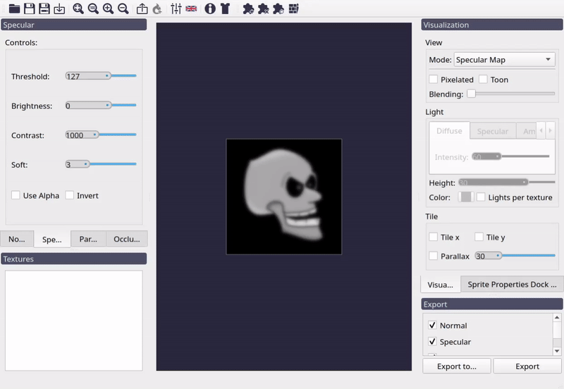
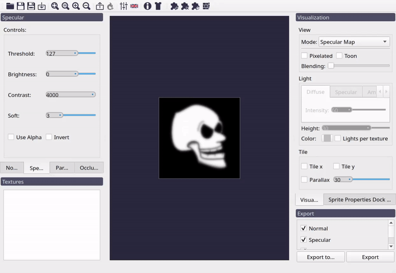
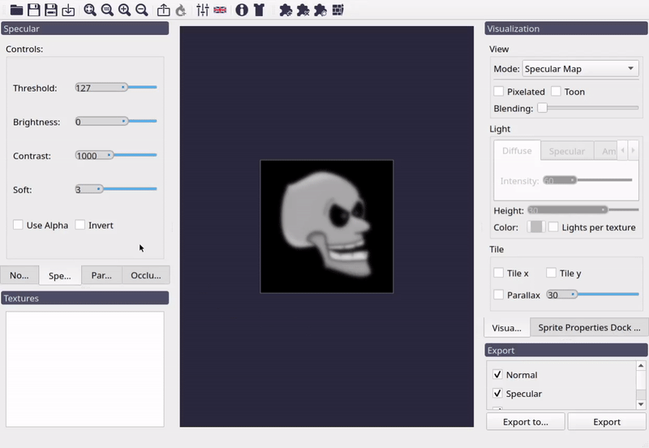

Specular Map Generation
=======================

Although Laigter is focused on genrating normal maps for 2D sprites, as those are the
most used maps for dynamic lighting in 2D, with the time, other map generations where
added. One of them is Specular Map Generation.

Introduction
------------

Specular maps are a lot simpler to understand than normal maps. Specular lighting is
based on reflective properties on material, and the angle of observation. When light
hits a surface, if its reflective, the light will bounce in the opposite angle
from the normal vector. Some ammount of this reflected light will reach the
ovserver's eye. But for specular lighting to work in a shader or engine, we need to
tell it how much reflective a surface is.

So, similarly than with normal maps, we store the reflectiveness in a texture. In
this case is easier, as we only need to store one parameter. So we can make a
grayscale image, where lighter colors mean more reflective, and darker colors mean
less reflective.

Laigter automatically generates a normal map based on the sprite, and lets you tweak
it with some simple controls. Most of them are usual effects for image processing
softwares.

.. note::
   For testing the followin explanations, please change view mode to *Specular Map*.
   Also note, you have to change to the *Specular* dock widget to access the controls
   being explained in this document.

Bright Control
--------------

This slider just adds a constant ammount to each pixel value. If the slider value is
0, the image will remain the same as the original. Is the value is positive, the
image will become lighter, and if it is negative, it will become darker.

   Effect of *Bright* control on specular map.

.. note::
   The effect of the specular lighting is that brighter spot you can see in above
   figure, at the top right of the head. Specular lighting depends on view direction,
   which in 2D is usually fixed from the center of the screen.

Contrast Control
----------------

This slider multiplies the color of each pixel by a value, to increase or decrease
the difference between light and dark colors in the image. This way, rising the value
will make lighter pixels even lighter, and darker pixels even darker. Lowering it
will make them more similar, until getting a full gray image at 0 contrast.

   Effect of *Contrast* control on specular map.

Threshold Control
-----------------

*Contrast* control reduce or increase the difference between ligth and dark pixels.
But how do we decide which pixels are considered dark and which considered light,
depends on the *Threshold* value. Usually, the threshold is 127 (the middle between
0 and 255 approximately). In laigter you can change this value, to apply the formula
from other reference value.

Lets assume in the previous example, you just want the teeth of the head to have
specular bright. Modifying *Bright* control won't work, because it makes the whole
texture reflectiveness change. Modifying *Contrast* alone won't work either, as
theeth and head colors are too similar. You can change then the threshold until you
see theeth remain in a lighter color, while de rest gets darker.

   Effect of *Threshold* control on specular map.

.. warning::
   This technique is quite limited and will only give good results on some cases. If
   you really need to customimze the specular map, its better to use a brush plugin,
   or loading a custom specular base from start.

Soft Control
------------

As in *Normal Map*, this control just adds some blur to the image. The higher the
value, the more blury the specular map will become.

   Effect of *Soft* control on specular map.

Invert Control
--------------

Invert checkbox is self-explanatory. It just inverts the colors of the specular map.

   Effect of *Invert* control on specular map.

