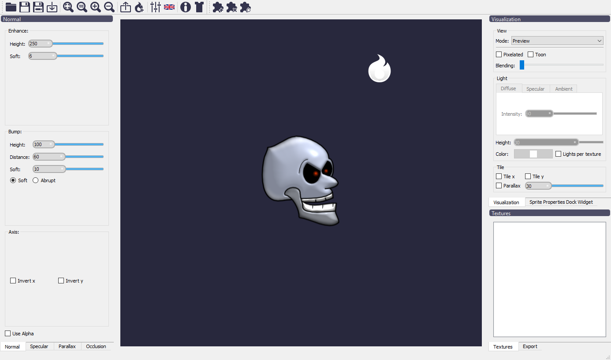

Introduction
=============

What is Laigter for?
--------------------

Laigter is mainly an automatic normal map generator focused in 2D Sprites. You just
need to drag and drop your images into Laigter, and normal map will be generated
for you. Then you can play arround with controls to adjust the map to get beter
results for your use case. You can also preview dynamic lighting in real time, to
check how the generated maps will affect lighting in-game.

Laigter also lets you generate and edit other maps, like specular, parallax and
occlusion, although they are a bit less used in 2D games compared to normal maps.
