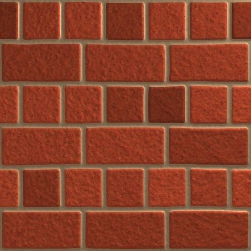

General Concepts
================

What is Laigter for?
--------------------

.. image:: img/MainWindow.png

Laigter is mainly an automatic normal map generator focused in 2D Sprites. You just
need to drag and drop your images into Laigter, and normal map will be generated
for you. Then you can play arround with controls to adjust the map to get beter
results for your use case. You can also preview dynamic lighting in real time, to
check how the generated maps will affect lighting in-game.

Laigter also lets you generate and edit other maps, like specular, parallax and
occlusion, although they are a bit less used in 2D games compared to normal maps.

Once you are convinced by the results, you can export each individual map, and use them in your game to create cool dynamic lighting effects with minimal effort!

What are normal maps?
---------------------

Normal maps are 2D textures which stores direction of the normal vector to a surface
on its RGB channels. This way, they can be used in a shader to calculate how should
light interact.

Normal maps are more often used in 3D games to achieve high quality lighting with low
cost. A 3D model is made from tiny triangles, each of one has a normal vector (unit
vector perpendicular to the triangle's surface). So light can bounce and reflect
according to that normal. However, to achieve high quality results, the model should have
a lot of triangles, wich increases the computational cost. With normal maps, you can
get a per-fragment normal, only needing to pass a texture with the information of the
normal vector on its RGB components. Then, this can be used to achive a more detailed
light interaction with very cheap gpu cost.

In 2D games, this is more noticeable, as we don't even have surfaces with normal
vectors to calculate lighting. We just have a flat sprite, so all lighting looks flat.
Using normal maps, we can give the illusion that the sprite has some kind of volume
when is lit.

   Bricks Texture Without Normal Map

   Bricks Texture With Normal Map

Normal Map Example
~~~~~~~~~~~~~~~~~~

The following image shows a normal map example.

But, how does a normal map store the normal vector on a RGB image? The concept is
quite simple. It stores the *x*, *y*, and *z* components of the vector on the *R*,
*G*, and *B* channels respectively, but with a small change. As a normal vector is
an unitary vector (its length is equal to 1), you only need values from -1 to 1 for
each axis. But RGB can store values from 0 to 1, so the normal map has the components
of the vector scaled by 0.5, and with a 0.5 offset. This causes the vector
:math: `(0.0, 0.0, 1.0)`
(normal vector pointing directly to screen) would transform into
:math: `(0.5, 0.5, 1.0)`
, and this is the reazon why normal maps have that blueish color.

Why chose Laigter?
------------------

There are other cool normal maps generators out there, but Laigter is free and
open source. This means you can grab the code yourself and implement missing
features if you need so, modify it, distribute your modified version to the public,
and much other freedoms open source gives.
Also, Laigter is extensible through plugins, so you can make your own extensions
and distribute/sell them freely.

Laigter is simple to use. You just need to open your images and tweak some controls.
The real time preview lets you check the result inmediatly.

Laigter's rendering is done in OpenGL 2.x standar, so you can use it on old machines.

Game Example
------------

This is how my current game looks, using Laigter for normal maps:

Support Laigter!
----------------

As Laigter is a free and open source project, it depends on the community to
continue improving. So, if you like it, consider contributing to the project
in some of this ways:

Become my Patreon_!
Support me on Kofi_!

.. _Patreon: https://www.patreon.com/azagaya
.. _Kofi: https://ko-fi.com/azagayavj
