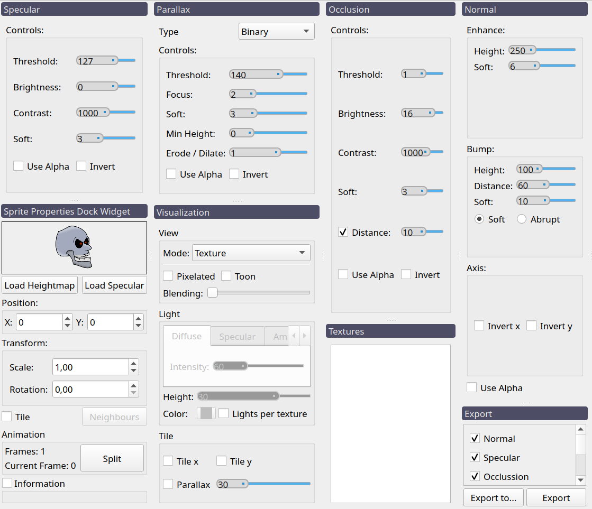

Laigter's Main Window
=====================

I try to keep Laigter's gui as simple as possible, with all needed controls at reach.
For this, the main window is made with a central widget, where all the rendering
happens, and movavle dock widgets, with the controls needed for tweak the maps.
Also, there is a tool bar with buttons for most used features of the tool.
When opening Laigter, you should see this window:

.. image:: img/MainWindow.png

Toolbar buttons
---------------

In the toolbar, you will notice a few buttons. This is a brief explanation of each
one, in order of appearance in the gui:

- |open| Open Project: Open a previously saved Laigter project file.
- |save| Save Project: Save current work as a Laigter project file. If the project has not been saver previously, it will trigger *Save As* instead.

- |save-as| Save As: Saves current work as a new Laigter project. A dialog will pop up and let you chose location and name of the file.

- |import| Import: Opens a dialog to chose images to import in laigter's current project.

- |fit-zoom| Fit Zoom: Applies the right ammount of zoom and translation of the canvas, in order to fit all textures in the current view.

- |100-zoom| Zoom 100%: Restores the default zoom (1:1 scale of the textures).
- |zoom+| Zoom +: Zooms in the canvas.
- |zoom-| Zoom -: Zooms out the canvas.

- |export| Export: Exports the maps of the currently selected texture. A dialog will let you chose the location and base name for the maps. Selecting which maps to export and batch exporting will be expanded on other sections.

- |add-light| Add Light: While on preview mode, it lets you add or remove ligth sources. Will be covered in other sections.

- |presets| Presets: Lets you save/load/apply presets to the selected textures. Will be covered in other sections.

- Language: Lets you select the language of your preference for the gui.

- |about| About: Opens a window with information about Laigter version, contributors, supporters, links to relevant sites, etc.

- |themes| Theme: Lets you select the theme for the gui.
- |add-plugin| Install Plugin: Opens a dialog to select a plugin from your file system and install it to Laigter.

- |remove-plugin| Delete Plugin: Opens a dialog to select and delete a specific plugin.

- |reload-plugin| Reload Plugin: Reload all installed plugins.

Dock Widgets
------------

Most of the controls of Laigter are placed in dock widgets that you can move arround the gui. The following image shows all the dock widgets together:

The controls of each individual dock widget will be explained on a section of their own, but here there is a brief explanation of the docks.

- Normal/Specular/Parallax/Occlusion: this docks contain the controls for tweaking the generation of each maps.
- Sprite Proerties Dock Widget: In this dock you have some controls and information of the currently selected sprite. You can change its position in the canvas, as well as its rotation and scale. You can select to generate maps in a *tiled* way, and chose how to extend it outside it bonds (select neighbours). Also, here you can make animations out of a sprite sheet, splitting the texture in multiple frames.
- Visualization: This docks lets you chose what map you want to see, or select preview to see the result with dinamyc lighting. Also some other controls let you tweak a bit the preview.
- Textures: This dock just contains a list of the currently opened textures. You can select multiple of them to show them all at the same time in the central widget.
- Export: in this dock you can select which maps you want to export, and if you want to export directly in the location of the original sprite (Export button) or to a specified folder (Export to.. button). This makes a batch export, exporting maps of all textures.

Sliders
-------

Almost all controls in Laigter's gui are standar, so no explanations are requiere to use them. However, the slider in Laigter is a custom widget, so a brief usage explanation may be useful.

A Slider in Laigter looks like this:

.. image img/Slider.png

The usage is simple. You can grab it from the right little square indicator, or you can simply write a number, and the slider value will be updated. And thats all!

.. |import| image:: img/import.png
            :scale: 50 %

