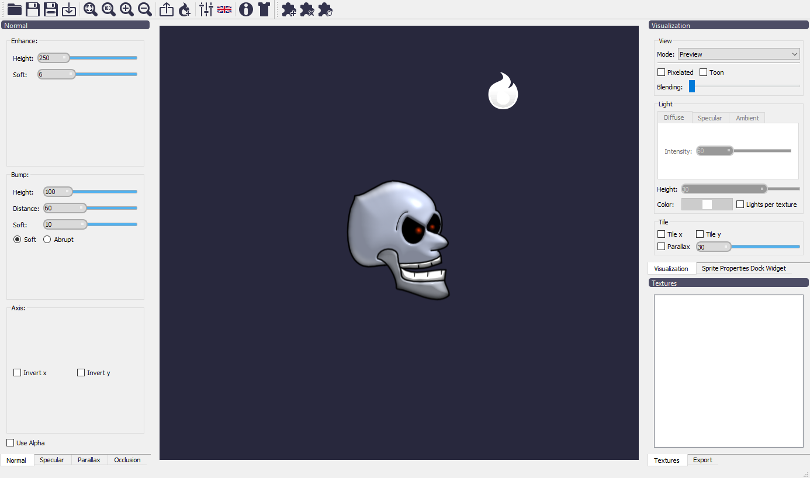

Laigter's Main Window
=====================

I try to keep Laigter's gui as simple as possible, with all needed controls at reach.
For this, the main window is made with a central widget, where all the rendering
happens, and movavle dock widgets, with the controls needed for tweak the maps.
Also, there is a tool bar with buttons for most used features of the tool.
When opening Laigter, you should see this window:

Toolbar buttons
---------------

In the toolbar, you will notice a few buttons. This is a brief explanation of each
one, in order of appearance in the gui:

- |open| Open Project: Open a previously saved Laigter project file.
- |save| Save Project: Save current work as a Laigter project file. If the project has not been saver previously, it will trigger *Save As* instead.

- |save-as| Save As: Saves current work as a new Laigter project. A dialog will pop up and let you chose location and name of the file.

- |import| Import: Opens a dialog to chose images to import in laigter's current
 project.

- |fit-zoom| Fit Zoom: Applies the right ammount of zoom and translation of the
 canvas, in order to fit all textures in the current view.

- |100-zoom| Zoom 100%: Restores the default zoom (1:1 scale of the textures).
- |zoom+| Zoom +: Zooms in the canvas.
- |zoom-| Zoom -: Zooms out the canvas.

- |export| Export: Exports the maps of the currently selected texture. A dialog will let you chose the location and base name for the maps. Selecting which maps to export and batch exporting will be expanded on other sections.

- |add-light| Add Light: While on preview mode, it lets you add or remove ligth sources. Will be covered in other sections.

- |presets| Presets: Lets you save/load/apply presets to the selected textures. Will be covered in other sections.

- Language: Lets you select the language of your preference for the gui.

- |about| About: Opens a window with information about Laigter version, contributors, supporters, links to relevant sites, etc.

- |themes| Theme: Lets you select the theme for the gui.
- |add-plugin| Install Plugin: Opens a dialog to select a plugin from your file system and install it to Laigter.

- |remove-plugin| Delete Plugin: Opens a dialog to select and delete a specific plugin.

- |reload-plugin| Reload Plugin: Reload all installed plugins.

.. |import| image:: img/import.png
.. |fit-zoom| image:: img/zoom_fit.png
.. |100-zoom| image:: img/zoom100.png
.. |zoom+| image:: img/zoom+.png
.. |zoom-| image:: img/zoom-.png
.. |export| image:: img/export.png

.. |presets| image:: img/presets.png
.. |about| image:: img/info.png
.. |themes| image:: img/theme-selector.png

.. |remove-plugin| image:: img/plugin-delete.png
.. |reload-plugin| image:: img/plugin-reload.png
